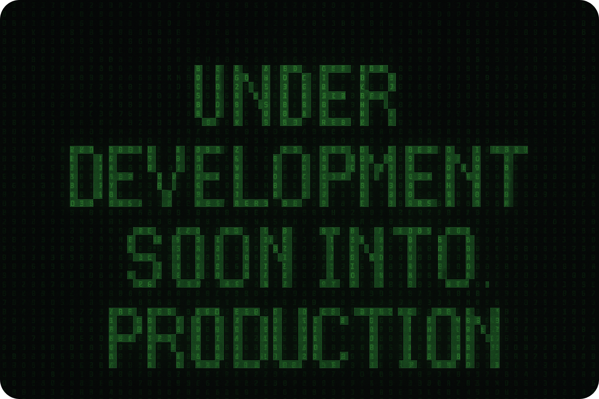

<div align="center">
  <br />
    <a href="https://dex-product-store.onrender.com/" target="_blank">
      
    </a>
  <br />

  <div>
    
    
    
    
  </div>

</div>

<div align="center">
   
    
    
    
    
    
    
    
</div>

  <h1 align="center">🛒 Dex-Product-Store</h1>

This is my personal project, **Dex-Product-Store**, built from the ground up to deeply understand the **PERN** (PostgreSQL, Express, React, Node) stack and put modern full-stack skills into practice.

The journey of creating this app was guided by the teachings, best practices, and source inspiration from [burakorkmez (codesistency on YouTube)](https://www.youtube.com/@codesistency), huge thanks for the lesson and inspiration! 🙌

---

## 📑 Table of Contents

- ✨ [Project Highlights](#project-highlight)
- 📁 [package.json (Backend)](#packagejson-backend)
- 💻 [package.json (Frontend)](#packagejson-frontend)
- 🚀 [Getting Started](#getting-started)
- 📚 [Documentation](#documentation)
- 🚢 [Deployment](#deployment)
- 👨‍💻 [About Me](#about-me)
- 🙏 [Acknowledgments](#acknowledgments)
- 📌 [Note](#note)

---

## <a name="project-highlight">✨ Project Highlights</a>

- **`Built from Scratch`**: 100% coded from the ground up to Learn the PERN Stack with the guide of "codesistency."
- **`Modern PERN Stack`**: PostgreSQL, Express, React, Node.js for full-stack robustness.
- **`Styling`**: Tailwind CSS + DaisyUI for responsive and beautiful UIs.
- **`Global State`**: Zustand for lightning-fast client state management.
- **`Security`**: Helmet, CORS, and ArcJet rate-limiting integration.
- **`DB Integration`**: PostgreSQL managed via `@neondatabase/serverless`.
- **`DX`**: Structured error handling on both frontend and backend for real-world readiness and great dev experience.
- **`Front-to-Back Ownership`**: Every line written was part of my step-by-step growth.
- **`Inspired by Codesistency`**: A full hands-on classroom experience in building PERN apps.

---

## <a name="packagejson-backend">📁 Backend `package.json`</a>

```json
{
  "name": "dex-product-store",
  "version": "1.0.0",
  "main": "backend/server.js",
  "scripts": {
    "dev": "nodemon backend/server.js",
    "build": "npm install && npm install --prefix frontend && npm run build --prefix frontend",
    "start": "node backend/server.js"
  },
  "keywords": [],
  "author": "",
  "type": "module",
  "private": true,
  "license": "SEE LICENSE IN LICENSE.md",
  "description": "",
  "dependencies": {
    "@arcjet/node": "^1.0.0-beta.1",
    "@neondatabase/serverless": "^0.10.4",
    "cors": "^2.8.5",
    "dotenv": "^16.4.7",
    "express": "^4.21.2",
    "helmet": "^8.0.0",
    "morgan": "^1.10.0"
  },
  "devDependencies": {
    "nodemon": "^3.1.9"
  }
}
```

---

## <a name="packagejson-frontend">💻 Frontend `package.json`</a>

```json
{
  "name": "frontend",
  "private": true,
  "version": "0.0.0",
  "type": "module",
  "scripts": {
    "dev": "vite",
    "build": "vite build",
    "lint": "eslint .",
    "preview": "vite preview"
  },
  "dependencies": {
    "axios": "^1.7.9",
    "lucide-react": "^0.474.0",
    "react": "^18.3.1",
    "react-dom": "^18.3.1",
    "react-hot-toast": "^2.5.1",
    "react-router-dom": "^7.1.5",
    "zustand": "^5.0.3"
  },
  "devDependencies": {
    "@eslint/js": "^9.17.0",
    "@types/react": "^18.3.18",
    "@types/react-dom": "^18.3.5",
    "@vitejs/plugin-react": "^4.3.4",
    "autoprefixer": "^10.4.20",
    "daisyui": "^4.12.23",
    "eslint": "^9.17.0",
    "eslint-plugin-react": "^7.37.2",
    "eslint-plugin-react-hooks": "^5.0.0",
    "eslint-plugin-react-refresh": "^0.4.16",
    "globals": "^15.14.0",
    "postcss": "^8.5.1",
    "tailwindcss": "^3.4.17",
    "vite": "^6.0.5"
  }
}
```

---

## <a name="getting-started">🚀 Getting Started</a>

### 1. Setup Environment Variables

Create a `.env` file in the root with the following:

```env
PORT=3000

PGUSER=
PGPASSWORD=
PGHOST=
PGDATABASE=

ARCJET_KEY=
ARCJET_ENV=development
```

### 2. Start the Backend (API)

```bash
cd backend
npm install
npm run dev
```

By default, the Express server will run on http://localhost:3000.

### 3. Start the Frontend

```bash
cd frontend
npm install
npm run dev
```

The React app will be served at http://localhost:5173 and proxy API requests to your backend.

### 4. Open the app

Navigate to http://localhost:5173 in your browser.
You can now create, edit, and delete notes via the UI!

---

## <a name="documentation">📚 Documentation</a>

- 🛠️ [Architecture Overview](./architecture.md)
- 🔄 [User Flow Diagram](./flowchart.md)

---

## <a name="deployment">🚢 Deployment</a>

The entire app is hosted on Render.com as two coordinated services **`Backend (Express API)`**, and **`Frontend (React + Vite)`**. Whenever you push to your main branch, Render will automatically rebuild and redeploy both services, and your React app will talk to the live Express API.

---

## <a name="about-me">👨‍💻 About Me</a>

Hi there! I’m **Dayle Cortes**, an American remote Full-Stack Software Engineer based in Florida.

- 🔭 I’m currently deepening my expertise in Full-Stack Development **PERN**, **MERN**, and **Next.js**
- 🌱 I love learning by doing coding-along with top instructors, then putting my own spin on projects to master every layer from database schema to production deployment.
- 💼 Outside of coding, I love to cook and workout.
- ⚡ Fun fact: I’m always trying to become a better version of myself than I was yesterday. Constantly learning with a growth mindset.

---

## <a name="acknowledgments">🙏 Acknowledgments</a>

Thanks again to **burakorkmez (codesistency)** for the detailed video tutorials, clear guidance, and in-depth walkthroughs on this PERN Stack Project.

---

## <a name="note">📌 Note</a>

This app was originally built by following @codesistency’s YouTube tutorial for learning and inspiration.  
The project was developed entirely in my local IDE (outside of GitHub) without initializing git, and I’ve reconstructed the commit history solely to reflect a realistic development flow and demonstrate my understanding of fullstack architecture and recent modifications, not as a record of the actual chronological build.

---
