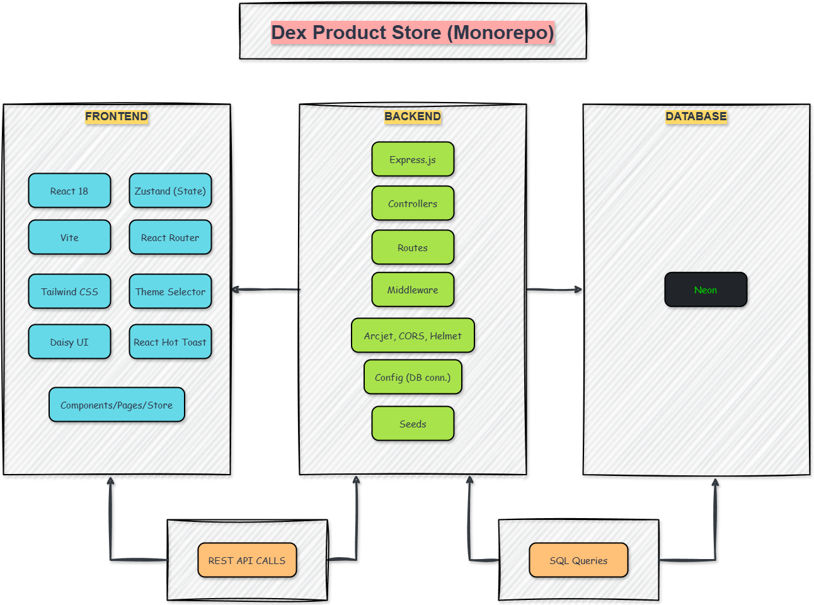

# 📐 Architecture Overview

Welcome to the architectural overview of **Dex Product Store**!  
This app was built by me, Dayle Cortes, to master the PERN stack (PostgreSQL, Express, React, Node.js) by applying hands-on, production-quality development practices. Deep Learning and methodology focus while following codesistency on YouTube.

---

## 📑 Table of Contents

- 🏗️ [High-Level Structure](#high-level-structure)
- 🗂️ [Folder & Layer Structure](#folder-layer-structure)
- 🔗 [Data Flow & API](#data-flow-api)
- 🛡️ [Security & Reliability](#security-reliability)
- 🌈 [UX/UI](#ux-ui)

---

## <a name="high-level-structure">🏗️ High-Level Structure</a>

Dex Product Store is a monorepo with clear **backend** and **frontend** separation. Showcasing a product store built using the **PERN** (PostgreSQL, Express, React, Node) stack and put modern full-stack skills into practice.

## 

- **Backend** (`/backend`):

  - Lightweight REST API server using **Express**
  - PostgreSQL database (Neon serverless) via `@neondatabase/serverless`
  - Security: [Helmet](https://www.npmjs.com/package/helmet) (HTTP headers), CORS, Arcjet rate limiting
  - Organized using route, controller, config, lib, and seed directories
  - Environment configuration via `.env`

- **Frontend** (`/frontend`):
  - Modern **React 18** SPA bootstrapped with **Vite**
  - Styling via **Tailwind CSS** and DaisyUI for rapid, themeable UI
  - **Zustand** for global state management (products, theme, etc.)
  - **React Router v7** for SPA routing
  - **React Hot Toast** for best-in-class notifications

---

## <a name="folder-layer-structure">🗂️ Folder & Layer Structure</a>

- **Dex-Product-Store/**

  - `README.md`, `package.json` – Monorepo-level docs, install & scripts

- **backend/**

  - `server.js`: App entry, Express setup, DB init
  - `config/`: Database config (Neon/PG)
  - `controllers/`: Product business logic
  - `routes/`: Express API endpoints for products
  - `seeds/`: Helper for seeding initial product data
  - `lib/arcjet.js`: Security/middleware
  - `.env` (root): Keeps secrets safe (DB, keys, etc.)

- **frontend/**
  - `index.html`, `vite.config.js`: App shell & dev server config
  - `src/`
    - `components/`: ProductCard, Navbar, ThemeSelector, Modals, etc.
    - `pages/`: Home, Product detail/edit view
    - `store/`: Zustand-based state management
    - `constants/`: Any shared constants/config
    - `index.css`: Tailwind/DaisyUI base styles
    - `main.jsx`, `App.jsx`: Bootstrapping and route layout

---

## <a name="data-flow-api">🔗 Data Flow & API</a>

- The frontend **spas** as a single-page React app, hitting the backend’s RESTful API for all CRUD product operations via `/api/products/...`.
- Zustand provides crisp state, no Redux bloat!
- All sensitive secrets and credentials are kept in `.env` (never checked in, thanks to `.gitignore`).
- Modern **ES Modules** standardization everywhere.

---

## <a name="security-reliability">🛡️ Security & Reliability</a>

- **Helmet** secures HTTP headers.
- **CORS** allows safe cross-origin frontend/backend dev.
- **Arcjet** (via `lib/arcjet.js`): Rate limiting, DDoS protection, etc.
- Error handling exists at controller and UI layer, fostering both reliability and user feedback.

---

## <a name="ux-ui">🌈 UX/UI</a>

- The frontend uses **Tailwind CSS** utility classes for design and **DaisyUI** for accessible, theme-ready components.
- **Theme switching** handled globally.
- Responsive layout, modern patterns, and engaging feedback (toasts, badges, counters).

---

For micro-level user-flow, please refer to [flowchart.md](./flowchart.md).

---

© 2025 Dayle Cortes - All Rights Reserved
