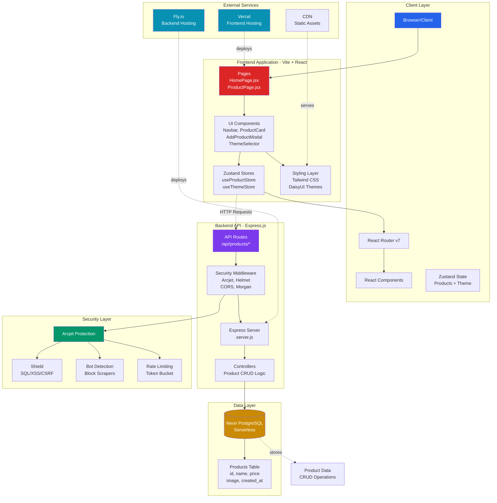

# 🛒 Dex-Product-Store Architecture

## Modern, Scalable, and Production-Ready

Dex-Product-Store is built from the ground up to be robust, maintainable, and a pleasure to work on. The system leverages production-level design patterns and modern tools, demonstrating industry best practices in full-stack development with the PERN stack (PostgreSQL, Express, React, Node.js).

---

## 📑 Table of Contents

- 🔑 [Key Principles](#key-principles)
- 🌿 [System Overview](#system-overview)
- 🚀 [Deployment, Security, and Maintainability](#deployment-security-maintainability)
- 🤔 [Why This Architecture?](#why-this-architecture)

---

### 🔑 Key Principles

| Principles                         | Purpose                                                                                                                                          |
| ---------------------------------- | ------------------------------------------------------------------------------------------------------------------------------------------------ |
| **Separation of Concerns**         | Each layer (UI, API, database, security) is cleanly separated for clarity and maintainability                                                    |
| **RESTful API Design**             | Backend provides a complete RESTful API with proper HTTP methods, status codes, and resource-based endpoints                                     |
| **State Management Excellence**    | Zustand provides lightweight, performant global state for products and themes without Redux complexity                                           |
| **Security-First Approach**        | Multi-layered security with Arcjet (rate limiting, bot detection, attack protection), Helmet (HTTP headers), and parameterized SQL queries       |
| **Optimized Developer Experience** | Hot-reloading, comprehensive inline documentation, modular architecture, and clear separation make extending or debugging friendly and efficient |

---

### 🌿 System Overview

```mermaid
graph TB
    subgraph "Client Layer"
        Browser[Browser/Client]
        React[React Components]
        Router[React Router v7]
        State[Zustand State<br/>Products + Theme]
    end

    subgraph "Frontend Application - Vite + React"
        Pages[Pages<br/>HomePage.jsx<br/>ProductPage.jsx]
        Components[UI Components<br/>Navbar, ProductCard<br/>AddProductModal<br/>ThemeSelector]
        Stores[Zustand Stores<br/>useProductStore<br/>useThemeStore]
        Styling[Styling Layer<br/>Tailwind CSS<br/>DaisyUI Themes]
    end

    subgraph "Backend API - Express.js"
        Server[Express Server<br/>server.js]
        Middleware[Security Middleware<br/>Arcjet, Helmet<br/>CORS, Morgan]
        Routes[API Routes<br/>/api/products/*]
        Controllers[Controllers<br/>Product CRUD Logic]
    end

    subgraph "Security Layer"
        Arcjet[Arcjet Protection]
        Shield[Shield<br/>SQL/XSS/CSRF]
        BotDetect[Bot Detection<br/>Block Scrapers]
        RateLimit[Rate Limiting<br/>Token Bucket]
    end

    subgraph "Data Layer"
        DB[(Neon PostgreSQL<br/>Serverless)]
        Schema[Products Table<br/>id, name, price<br/>image, created_at]
    end

    subgraph "External Services"
        Vercel[Vercel<br/>Frontend Hosting]
        Flyio[Fly.io<br/>Backend Hosting]
        CDN[CDN<br/>Static Assets]
    end

    Browser --> Pages
    Pages --> Components
    Components --> Stores
    Components --> Styling
    Stores --> Router
    Router --> React

    Stores -.HTTP Requests.-> Routes
    Routes --> Middleware
    Middleware --> Arcjet
    Arcjet --> Shield
    Arcjet --> BotDetect
    Arcjet --> RateLimit

    Middleware --> Server
    Server --> Controllers
    Controllers --> DB
    DB --> Schema

    Vercel -.deploys.-> Pages
    Flyio -.deploys.-> Server
    CDN -.serves.-> Styling

    DB -.stores.-> ProductData[Product Data<br/>CRUD Operations]

    style Browser fill:#2563eb,color:#ffffff
    style Pages fill:#dc2626,color:#ffffff
    style Routes fill:#7c3aed,color:#ffffff
    style Arcjet fill:#059669,color:#ffffff
    style DB fill:#ca8a04,color:#ffffff
    style Vercel fill:#0891b2,color:#ffffff
    style Flyio fill:#0891b2,color:#ffffff
```

**Infrastructure Details:**

- **Vercel (Frontend)**: Hosts the React SPA with serverless functions, automatic deployments, and CDN
- **Fly.io (Backend)**: Hosts the Express API in containers with automatic scaling and global distribution
- **Neon (Database)**: Serverless PostgreSQL with automatic scaling, connection pooling, and high availability
- **Environment Variables**: Secrets injected securely at build and runtime via platform configurations

---

**Frontend**: Built with React 18 (via Vite) and powered by modern tooling for a highly interactive, performant user experience. The UI leverages Tailwind CSS and DaisyUI for beautiful, themeable components that work seamlessly across devices.

**Routing**: React Router v7 provides client-side navigation with two main routes: HomePage (`/`) for product catalog and ProductPage (`/product/:id`) for individual product management.

**State Management**: Zustand powers global state with two stores:

- `useProductStore`: Manages products array, CRUD operations, loading states, and form data
- `useThemeStore`: Handles theme selection with localStorage persistence

**Backend/Server**: Express.js REST API with organized architecture:

- **Routes** (`/api/products/*`): RESTful endpoints for CRUD operations
- **Controllers**: Business logic for product management with validation
- **Middleware**: Security layers (Arcjet, Helmet, CORS) and logging (Morgan)
- **Database**: Neon PostgreSQL with tagged template literals for SQL injection protection

**Security & Protection**: Multi-layered security approach:

- **Arcjet**: Advanced threat protection with shield (SQL/XSS/CSRF), bot detection, and rate limiting (30 req/5sec)
- **Helmet**: HTTP security headers (X-Frame-Options, X-Content-Type-Options, HSTS)
- **CORS**: Configured for cross-origin requests between frontend and backend
- **SQL Safety**: Parameterized queries via Neon's tagged template literals

**Database/ORM**: Neon PostgreSQL (serverless) with:

- Simple schema: products table with id, name, price, image, created_at
- Connection pooling and automatic scaling
- SSL/TLS encryption for all connections
- Tagged template literals for safe, expressive queries

**Styling**: Tailwind CSS + DaisyUI provides:

- Utility-first CSS for rapid development
- 13+ pre-built themes with dark mode support
- Responsive design with mobile-first approach
- Smooth theme transitions with CSS transitions

---

### 🚀 Deployment, Security, and Maintainability

**Deployment Architecture**:

- **Frontend**: Deployed on Vercel with automatic deployments from Git, serverless functions, and global CDN
- **Backend**: Deployed on Fly.io in Docker containers with health checks, automatic scaling, and multi-region support
- **Database**: Neon serverless PostgreSQL with automatic backups, connection pooling, and high availability

**CI/CD Pipeline**:

- Vercel: Automatic deployments on push to main, preview deployments for PRs
- Fly.io: Docker-based deployments with automatic rollbacks and health monitoring
- Environment-specific configurations for development and production

**Security Measures**:

- **API Protection**: Arcjet provides rate limiting (token bucket algorithm), bot detection (blocks scrapers, allows search engines), and shield protection (SQL injection, XSS, CSRF)
- **HTTP Security**: Helmet middleware adds security headers to prevent common attacks
- **Database Security**: SSL-enforced connections, parameterized queries, environment-based credentials
- **Secrets Management**: All sensitive data in environment variables, never committed to version control

**Code Quality**:

- Comprehensive inline documentation with JSDoc comments
- Modular file structure following separation of concerns
- ES Modules throughout the codebase
- Error handling at controller and UI layers
- Toast notifications for user feedback

**Performance Optimizations**:

- Vite for fast development and optimized production builds
- React 18 features for concurrent rendering
- Zustand for minimal re-renders and optimal state management
- Neon connection pooling for efficient database access
- CDN delivery for static assets

---

## 🤔 Why This Architecture?

This architecture represents carefully evaluated tradeoffs focusing on developer happiness, security, scalability, and production readiness.

Every layer was chosen specifically for:

- **Developer Experience**: Vite's hot-reload, Zustand's simplicity, comprehensive inline docs, modular structure
- **Security & Reliability**: Arcjet's multi-layer protection, Helmet security headers, parameterized queries, error boundaries
- **Performance**: React 18 concurrent features, Vite optimization, Zustand efficiency, Neon connection pooling
- **Scalability**: Serverless architecture (Vercel + Fly.io + Neon), microservices pattern, stateless API design
- **Maintainability**: Clear separation of concerns, RESTful API design, comprehensive documentation, modular components

The PERN stack provides:

- **PostgreSQL**: Reliable, feature-rich relational database with ACID guarantees
- **Express**: Minimal, flexible web framework with massive ecosystem
- **React**: Component-based UI with excellent performance and developer tools
- **Node.js**: JavaScript everywhere, enabling code sharing and unified development

---

For micro-level user-flow, please refer to [flowchart.md](./flowchart.md).

---

© 2025 Dayle Cortes - All Rights Reserved
