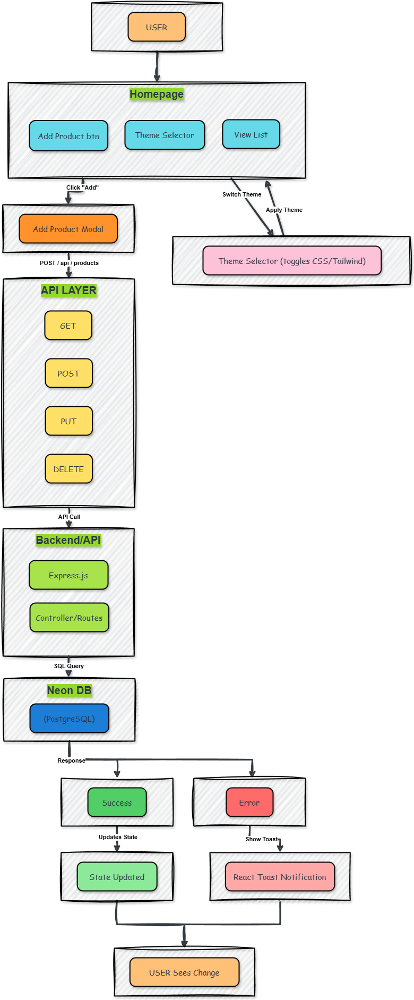

# 🔄 User Flow Diagram

Welcome to the **User Flow** visualization for **Dex Product Store**!  
While the [architecture.md](./architecture.md) shows the macro-level structure, this flowchart focuses on the micro-level interactions between the user, frontend, API, and database.

---

## 📑 Table of Contents

- 🧑‍💻 [User Journey Overview](#user-journey-overview)
- 🎨 [Theme Selection Flow](#theme-selection-flow)
- 📝 [Product Management Flow](#product-management-flow)
- 🔄 [API Interaction Layer](#api-interaction-layer)
- 📊 [State Management & Feedback](#state-management-feedback)

---

## <a name="user-journey-overview">🧑‍💻 User Journey Overview</a>

The flowchart below illustrates how users interact with the Dex Product Store application, from viewing products to managing them through the UI and how those actions propagate through the system.

## 

---

## <a name="user-journey-overview">🧑‍💻 User Journey Overview</a>

The user experience follows these primary paths:

1. **`Homepage Entry`**: User lands on the main product listing page
2. **`UI Interactions`**: User can:
   - View the product list
   - Click "Add Product" button
   - Toggle theme via Theme Selector
3. **`Product Management`**: Adding, editing, or deleting products
4. **`Theme Customization`**: Changing the application's visual appearance
5. **`Feedback Loop`**: Receiving toast notifications on actions

---

## <a name="theme-selection-flow">🎨 Theme Selection Flow</a>

The theme selection process demonstrates Zustand state management:

1. User clicks the Theme Selector component
2. Theme toggle action is dispatched
3. Zustand updates the global theme state
4. React re-renders with the new theme applied via Tailwind/DaisyUI
5. No API calls required, purely client-side state

---

## <a name="product-management-flow">📝 Product Management Flow</a>

### Adding a Product

1. User clicks "Add Product" button on HomePage
2. Add Product Modal component appears
3. User fills form with product details
4. On submit:
   - Form data is validated
   - POST request sent to API
   - Backend processes request
   - Database record created
   - Response returns to frontend
   - Zustand store updates
   - Success/error toast displayed
   - Modal closes on success

### Editing/Deleting Products

Similar flow applies to edit (PUT) and delete (DELETE) operations, with appropriate API endpoints and UI feedback.

---

## <a name="api-interaction-layer">🔄 API Interaction Layer</a>

The API layer handles four primary operations:

- **`GET`**: Fetch products list or single product
- **`POST`**: Create new product
- **`PUT`**: Update existing product
- **`DELETE`**: Remove product

Each request flows through:

1. Frontend API call (Axios)
2. Backend Express routes
3. Controller logic
4. Database query
5. Response handling

---

## <a name="state-management-feedback">📊 State Management & Feedback</a>

### Success Path

1. API returns successful response
2. Frontend updates Zustand store
3. UI reflects changes immediately
4. Success toast notification appears
5. User sees confirmation of their action

### Error Path

1. API returns error response
2. Frontend handles error gracefully
3. Error toast notification appears
4. UI remains in consistent state
5. User can retry or take alternative action

---

This flowchart demonstrates the reactive nature of the application, with state changes propagating through the system and providing immediate feedback to users.

---

For high-level system architecture, please refer to [architecture.md](./architecture.md).

---

© 2025 Dayle Cortes — All Rights Reserved
