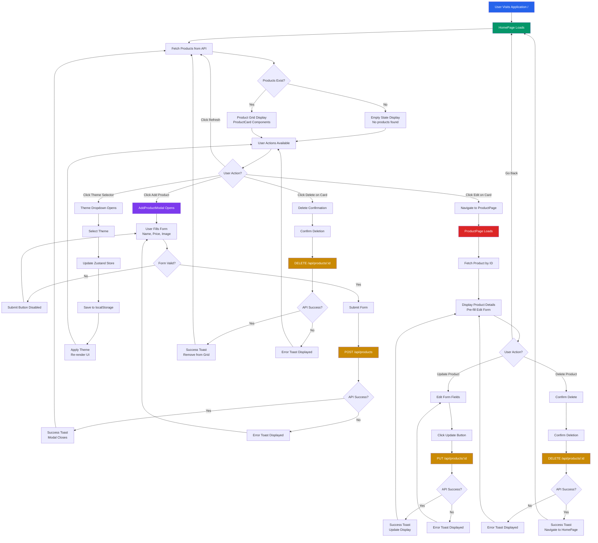

# 🗺️ User Flow & Interaction Diagram

## Micro-level: Product Management Journey from Homepage to CRUD Operations

This document visualizes the **step-by-step flow** of user interactions in the Dex Product Store application.  
While [architecture.md](./architecture.md) shows the macro-level system structure, this flowchart focuses on the micro-level interactions between the user, UI components, state management, API, and database.

---

## 📑 Table of Contents

- 🔄 [User Interaction Flow](#user-interaction-flow)
- 📝 [Product Management Operations](#product-management-operations)
- 🎨 [Theme Customization Flow](#theme-customization-flow)
- 🔗 [API and State Management](#api-state-management)

---

## 🔄 User Interaction Flow

```mermaid
graph TD
    A[User Visits Application /] --> B[HomePage Loads]
    B --> C[Fetch Products from API]
    C --> D{Products Exist?}

    D -->|No| E[Empty State Display<br/>No products found]
    D -->|Yes| F[Product Grid Display<br/>ProductCard Components]

    E --> G[User Actions Available]
    F --> G

    G --> H{User Action?}

    H -->|Click Add Product| I[AddProductModal Opens]
    H -->|Click Refresh| C
    H -->|Click Theme Selector| J[Theme Dropdown Opens]
    H -->|Click Edit on Card| K[Navigate to ProductPage]
    H -->|Click Delete on Card| L[Delete Confirmation]

    I --> M[User Fills Form<br/>Name, Price, Image]
    M --> N{Form Valid?}
    N -->|No| O[Submit Button Disabled]
    O --> M
    N -->|Yes| P[Submit Form]
    P --> Q[POST /api/products]
    Q --> R{API Success?}
    R -->|Yes| S[Success Toast<br/>Modal Closes]
    R -->|No| T[Error Toast Displayed]
    T --> M
    S --> C

    J --> U[Select Theme]
    U --> V[Update Zustand Store]
    V --> W[Save to localStorage]
    W --> X[Apply Theme<br/>Re-render UI]
    X --> G

    K --> Y[ProductPage Loads]
    Y --> Z[Fetch Product by ID]
    Z --> AA[Display Product Details<br/>Pre-fill Edit Form]
    AA --> AB{User Action?}
    AB -->|Update Product| AC[Edit Form Fields]
    AB -->|Delete Product| AD[Confirm Delete]
    AB -->|Go Back| B

    AC --> AE[Click Update Button]
    AE --> AF[PUT /api/products/:id]
    AF --> AG{API Success?}
    AG -->|Yes| AH[Success Toast<br/>Update Display]
    AG -->|No| AI[Error Toast Displayed]
    AH --> AA
    AI --> AC

    L --> AJ[Confirm Deletion]
    AJ --> AK[DELETE /api/products/:id]
    AK --> AL{API Success?}
    AL -->|Yes| AM[Success Toast<br/>Remove from Grid]
    AL -->|No| AN[Error Toast Displayed]
    AM --> C
    AN --> G

    AD --> AO[Confirm Deletion]
    AO --> AP[DELETE /api/products/:id]
    AP --> AQ{API Success?}
    AQ -->|Yes| AR[Success Toast<br/>Navigate to HomePage]
    AQ -->|No| AS[Error Toast Displayed]
    AR --> B
    AS --> AA

    style A fill:#2563eb,color:#ffffff
    style B fill:#059669,color:#ffffff
    style I fill:#7c3aed,color:#ffffff
    style Y fill:#dc2626,color:#ffffff
    style Q fill:#ca8a04,color:#ffffff
    style AF fill:#ca8a04,color:#ffffff
    style AK fill:#ca8a04,color:#ffffff
    style AP fill:#ca8a04,color:#ffffff
```

---

## 📝 Product Management Operations

### Creating a Product

1. **User clicks "Add Product" button** on HomePage
2. **AddProductModal opens** via DaisyUI dialog element
3. **User fills form** with product details:
   - Product Name (text input with Package icon)
   - Price (number input with Dollar icon, min: 0, step: 0.01)
   - Image URL (text input with Image icon)
4. **Form validation** occurs in real-time:
   - Submit button disabled if any field is empty
   - Loading spinner shown during submission
5. **Form submission**:
   - Zustand `addProduct()` action called
   - POST request to `/api/products` with form data
   - Backend validates and creates product in Neon database
6. **Success handling**:
   - Product added to database
   - Products list refreshed via `fetchProducts()`
   - Success toast notification displayed
   - Modal automatically closes
   - Form resets for next entry
7. **Error handling**:
   - Error toast displayed with message
   - Modal remains open for user to retry
   - Form data preserved

### Editing a Product

1. **User clicks "Edit" button** on ProductCard
2. **Navigate to ProductPage** via React Router (`/product/:id`)
3. **Page loads product data**:
   - Zustand `fetchProduct(id)` called
   - GET request to `/api/products/:id`
   - Form pre-filled with current product data
4. **User modifies form fields**:
   - Name, Price, or Image URL updated
   - Changes reflected in Zustand formData state
5. **Form submission**:
   - Zustand `updateProduct(id)` action called
   - PUT request to `/api/products/:id` with updated data
   - Backend validates and updates product in database
6. **Success handling**:
   - Product updated in database
   - Current product state refreshed
   - Success toast notification displayed
   - Updated data shown immediately
7. **Error handling**:
   - Error toast displayed with message
   - Form data preserved for retry

### Deleting a Product

**From HomePage (ProductCard)**:

1. **User clicks "Delete" button** on ProductCard
2. **Browser confirmation dialog** appears (optional, if implemented)
3. **Delete action**:
   - Zustand `deleteProduct(id)` called
   - DELETE request to `/api/products/:id`
   - Backend removes product from database
4. **Success handling**:
   - Product removed from local products array
   - Product card removed from grid (optimistic update)
   - Success toast notification displayed
5. **Error handling**:
   - Error toast displayed with message
   - Product remains in grid

**From ProductPage**:

1. **User clicks "Delete" button** on product detail page
2. **Confirmation step** (if implemented)
3. **Delete action** (same as above)
4. **Success handling**:
   - Product deleted from database
   - Navigate back to HomePage (`/`)
   - Success toast displayed
5. **Error handling**:
   - Error toast displayed
   - User remains on ProductPage

### Viewing Products

1. **HomePage mounts** and triggers `useEffect`
2. **Fetch products**:
   - Zustand `fetchProducts()` called automatically
   - GET request to `/api/products`
   - Backend retrieves all products from database (ordered by created_at DESC)
3. **Loading state**:
   - Loading spinner displayed during fetch
   - Prevents layout shift
4. **Display products**:
   - Products array populated in Zustand store
   - ProductCard components rendered in responsive grid:
     - Mobile: 1 column
     - Tablet: 2 columns
     - Desktop: 3 columns
5. **Empty state**:
   - If no products exist, show empty state UI
   - Package icon and friendly message
   - Call-to-action to add first product
6. **Error handling**:
   - Error alert displayed at top of page
   - Rate limit error (429) shows specific message
   - Generic error for other failures

---

## 🎨 Theme Customization Flow

The theme system demonstrates client-side state management with persistence:

### Theme Selection Process

1. **User opens theme selector** in Navbar
2. **Theme dropdown displays** available DaisyUI themes:
   - forest (default)
   - pastel, retro, coffee, cyberpunk, synthwave
   - luxury, autumn, valentine, aqua, business, night, dracula
3. **User selects theme**:
   - Zustand `setTheme(themeName)` action called
   - Theme saved to localStorage with key `preferred-theme`
   - Zustand state updated to new theme value
4. **Theme application**:
   - App component re-renders with new theme
   - `data-theme` attribute updated on root container
   - All DaisyUI components inherit new theme
   - CSS transitions provide smooth color changes
5. **Persistence**:
   - Theme preference saved in localStorage
   - Survives browser restarts and tab closures
   - Automatically loaded on next visit
6. **No API calls required** - purely client-side operation

---

## 🔗 API and State Management

### Request Flow Pattern

Every API operation follows this consistent pattern:

1. **User Action** → UI Component
2. **Zustand Action** → State update (loading: true)
3. **Axios HTTP Request** → Backend API
4. **Arcjet Security Check** → Rate limit, bot detection, shield
5. **Express Route** → Middleware processing
6. **Controller Function** → Business logic
7. **Database Query** → Neon PostgreSQL
8. **Response** → Back through layers
9. **State Update** → Zustand store (loading: false, data/error)
10. **UI Update** → React re-render
11. **User Feedback** → Toast notification

### State Management with Zustand

**useProductStore** manages:

- `products`: Array of all products
- `loading`: Boolean for async operations
- `error`: String for error messages
- `currentProduct`: Single product for editing
- `formData`: Form state (name, price, image)
- `addProduct()`: Create product
- `fetchProducts()`: Get all products
- `fetchProduct(id)`: Get single product
- `updateProduct(id)`: Update product
- `deleteProduct(id)`: Delete product
- `setFormData()`: Update form state
- `resetForm()`: Clear form state

**useThemeStore** manages:

- `theme`: Current theme name
- `setTheme()`: Update theme and persist to localStorage

### Error Handling Strategy

**API Errors**:

- 429 (Rate Limit): "Rate limit exceeded" message
- 404 (Not Found): "Product not found" message
- 500 (Server Error): "Something went wrong" message
- Network errors: Generic error message

**UI Feedback**:

- Error toast notifications (React Hot Toast)
- Error alerts for persistent errors
- Loading states to prevent multiple submissions
- Form validation to prevent invalid data

**State Consistency**:

- Optimistic updates for delete operations
- Refresh data after mutations
- Loading states prevent race conditions
- Error state clears on successful operations

---

## 💡 Why This Flow?

This flowchart provides the team and newcomers with an "at-a-glance" reference of how users travel through the app and how data flows through the system. It supports:

- **Planning**: Understanding user journeys for feature development
- **Testing**: Identifying critical paths and edge cases
- **Debugging**: Tracing issues through the application flow
- **Onboarding**: Helping new developers understand the application
- **Documentation**: Serving as living documentation of the system

For high-level system architecture, please refer to [architecture.md](./architecture.md).

---

© 2025 Dayle Cortes - All Rights Reserved
